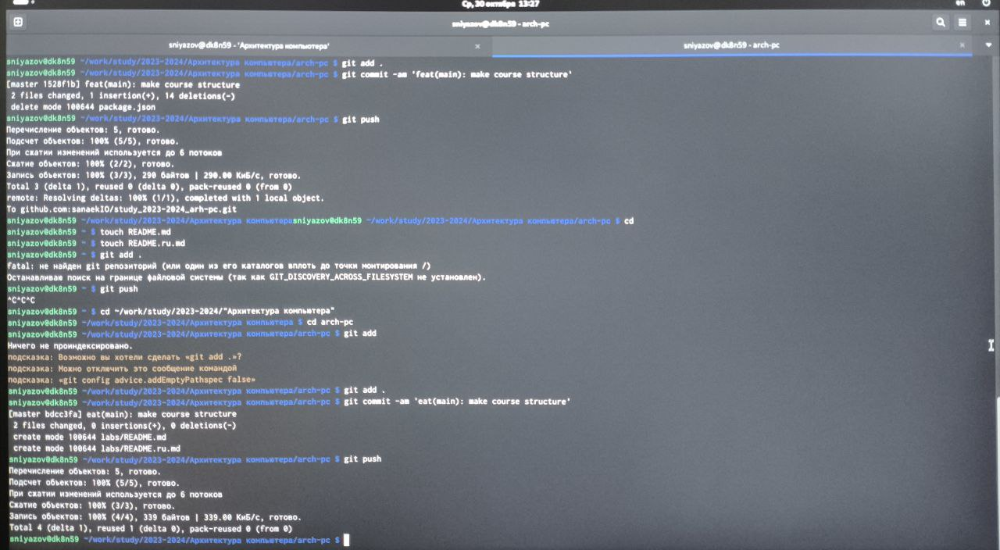
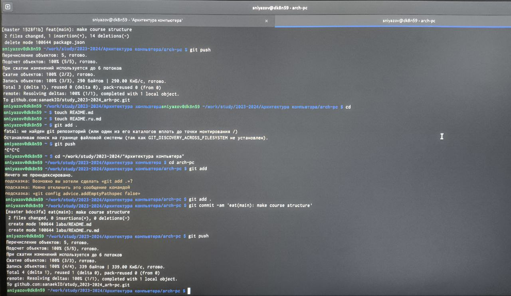
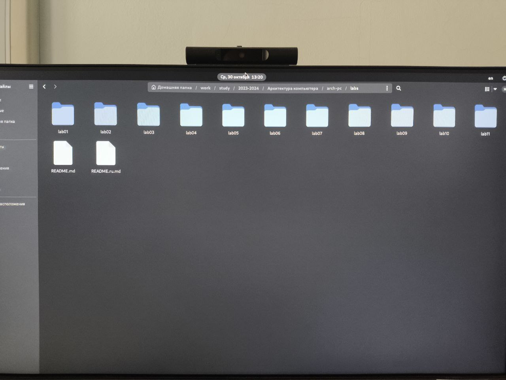
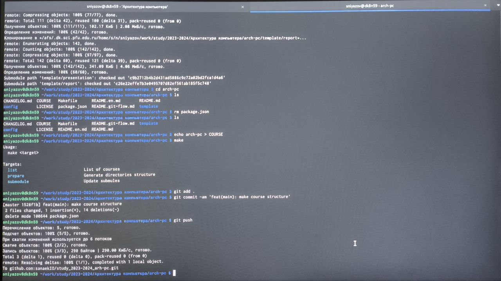
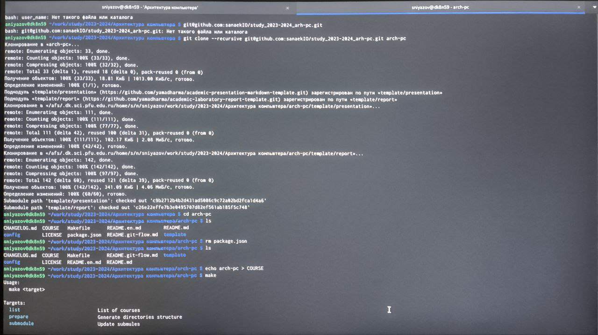
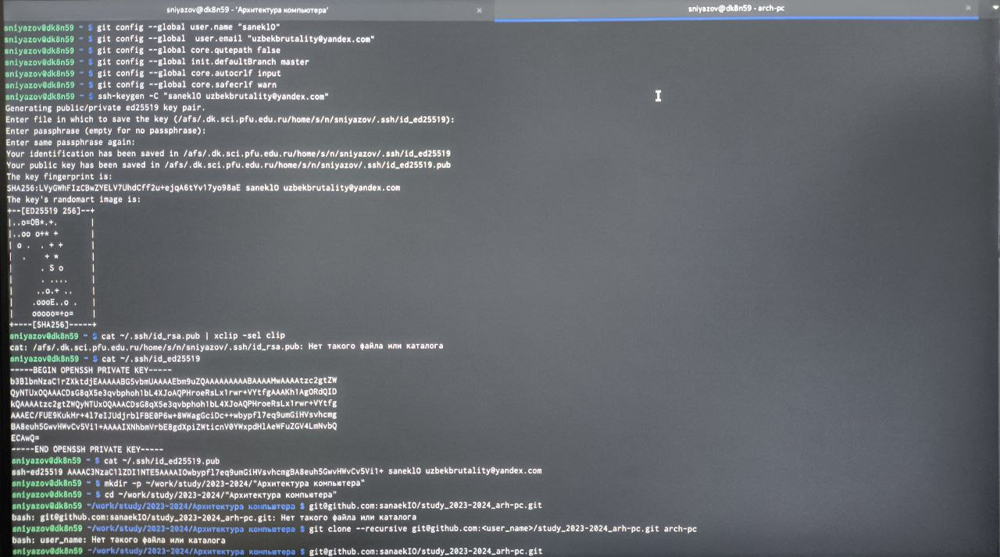
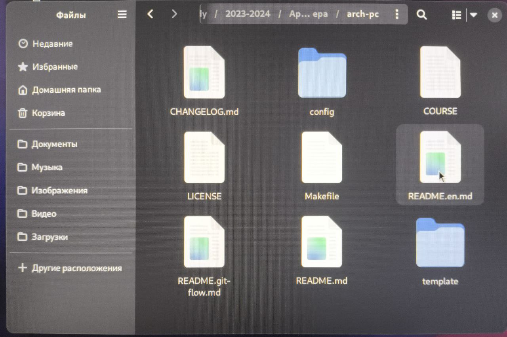
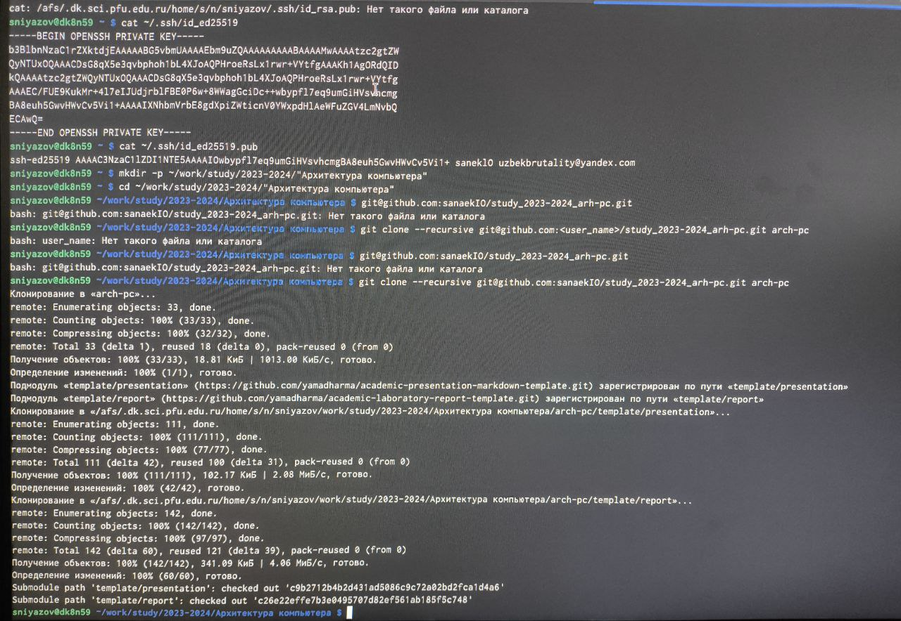
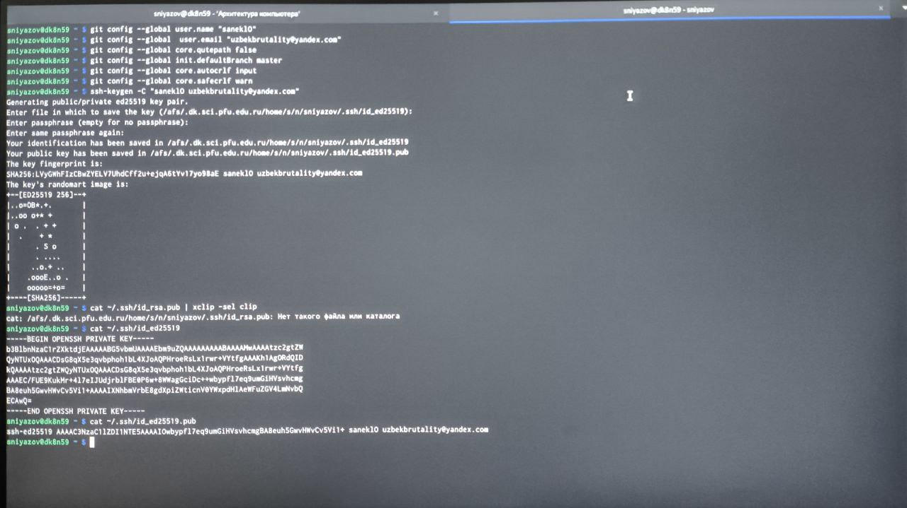
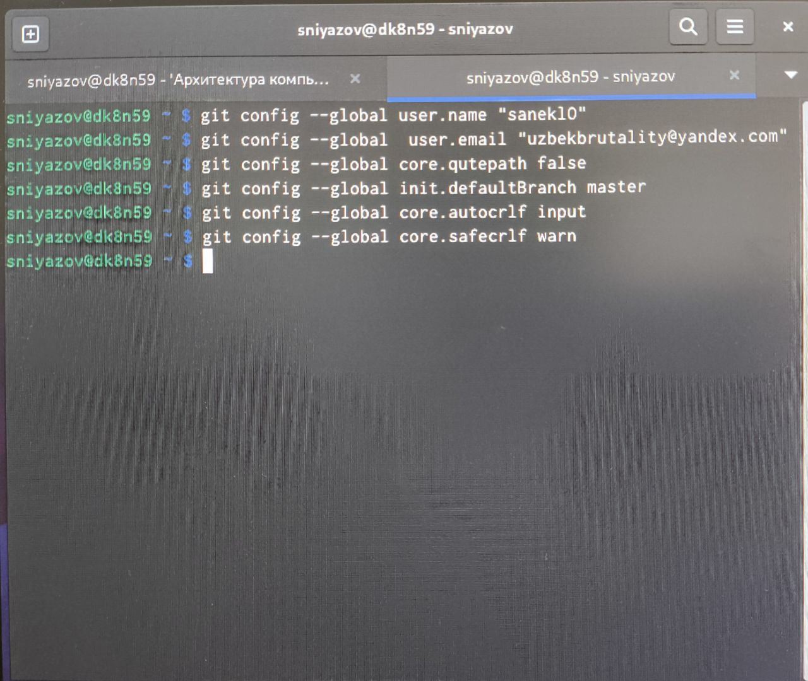

---
## Front matter
title: "Шаблон отчёта по лабораторной работa 2"
subtitle: "Система контроля
версий Git"
author: "Ниязов Санджар"

## Generic otions
lang: ru-RU
toc-title: "Содержание"

## Bibliography
bibliography: bib/cite.bib
csl: pandoc/csl/gost-r-7-0-5-2008-numeric.csl

## Pdf output format
toc: true # Table of contents
toc-depth: 2
lof: true # List of figures
lot: true # List of tables
fontsize: 12pt
linestretch: 1.5
papersize: a4
documentclass: scrreprt
## I18n polyglossia
polyglossia-lang:
  name: russian
  options:
	- spelling=modern
	- babelshorthands=true
polyglossia-otherlangs:
  name: english
## I18n babel
babel-lang: russian
babel-otherlangs: english
## Fonts
mainfont: IBM Plex Serif
romanfont: IBM Plex Serif
sansfont: IBM Plex Sans
monofont: IBM Plex Mono
mathfont: STIX Two Math
mainfontoptions: Ligatures=Common,Ligatures=TeX,Scale=0.94
romanfontoptions: Ligatures=Common,Ligatures=TeX,Scale=0.94
sansfontoptions: Ligatures=Common,Ligatures=TeX,Scale=MatchLowercase,Scale=0.94
monofontoptions: Scale=MatchLowercase,Scale=0.94,FakeStretch=0.9
mathfontoptions:
## Biblatex
biblatex: true
biblio-style: "gost-numeric"
biblatexoptions:
  - parentracker=true
  - backend=biber
  - hyperref=auto
  - language=auto
  - autolang=other*
  - citestyle=gost-numeric
## Pandoc-crossref LaTeX customization
figureTitle: "Рис."
tableTitle: "Таблица"
listingTitle: "Листинг"
lofTitle: "Список иллюстраций"
lotTitle: "Список таблиц"
lolTitle: "Листинги"
## Misc options
indent: true
header-includes:
  - \usepackage{indentfirst}
  - \usepackage{float} # keep figures where there are in the text
  - \floatplacement{figure}{H} # keep figures where there are in the text
---

# Цель работы

Ознакомиться с работой Git, выполнить задание в соответсствии с лабораторной работы а также составить отчет о выполненной работе.

# Задание

1)Изучить документацию приложенную к лабораторной работе
2)Настроить Гитхаб
3)Создать SSH ключ, а также рабочее пространство
4)Создание репозитория и настройка каталога курса
5)Выполнение заданий для самостоятельной работы

# Теоретическое введение
Команда описания
git commit -am      сохранить все добавленные изменения и все измененые файлы
'Описание коммита'
git checkout -b     создание новой ветки,базирующийся на текущей
'имя_метки'
git chechout        переключения на некоторую ветку 
'имя_ветки'
git push origin     отправка изменения конктрентной ветки в центральной репозиторий 
'имя_ветки'
git merge           слияние ветки с текущим деревом
--no-ff
имя_ветки
git branch -d       удаления локальной уже слитой с основным леревом ветки
имя_ветки
git branch -D       принудительное удаления локальной ветки
имя_ветки
git push origin     удаления ветки с центрального репозитория
имя_ветки
git init            создание основного дерева репозитория
git pull            получения обновлений,изменений текущего дерева из центрального репозитория
git push            отправка всех произведенных изменений локального дерева из центральный репозитория
git status          просмотр списка измененых файлов в текущий директории
git dif             просмотр текущих изменения
git add .           добавить все измененные и/или созданные файлы и/или каталоги
git add             добавить конкретные измененные и/или созданные файлы и/или каталоги
имена_файла
git rm              удалить файл и/или каталог из индекса репозиторий,при этом файл и/или                 каталог остается в локальной директорий
имена_файла

# Выполнение лабораторной работы

# Выводы

В процессе выполнения работы, я ознакомился с git. Изучил ряд команд, а
также подготовил рабочее пространство.

# Список литературы{.unnumbered}
