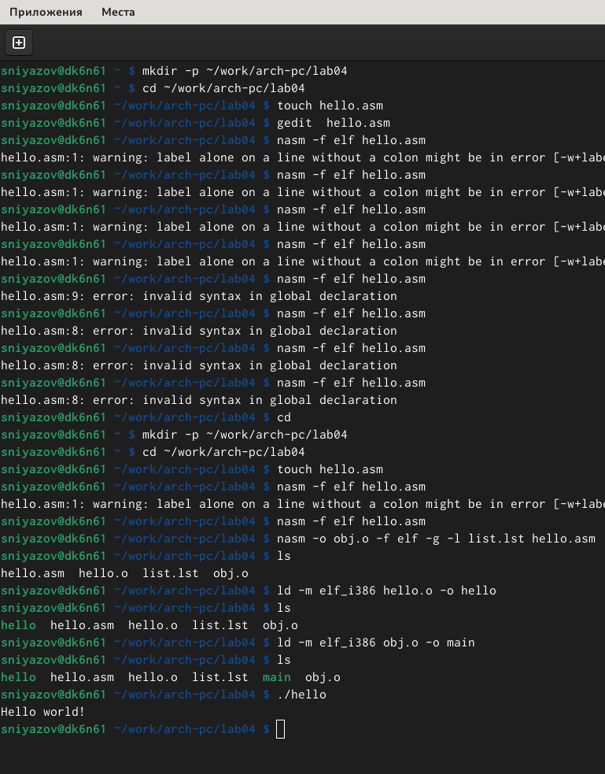
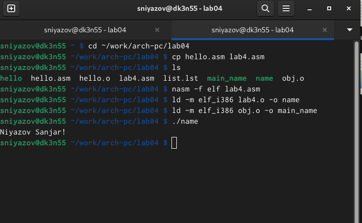

---
## Front matter
title: "Шаблон отчёта по лабораторной работе 4"
subtitle: "язык ассемблера NASM"
author: "Ниязов С.М."

## Generic otions
lang: ru-RU
toc-title: "Содержание"

## Bibliography
bibliography: bib/cite.bib
csl: pandoc/csl/gost-r-7-0-5-2008-numeric.csl

## Pdf output format
toc: true # Table of contents
toc-depth: 2
lof: true # List of figures
lot: true # List of tables
fontsize: 12pt
linestretch: 1.5
papersize: a4
documentclass: scrreprt
## I18n polyglossia
polyglossia-lang:
  name: russian
  options:
	- spelling=modern
	- babelshorthands=true
polyglossia-otherlangs:
  name: english
## I18n babel
babel-lang: russian
babel-otherlangs: english
## Fonts
mainfont: IBM Plex Serif
romanfont: IBM Plex Serif
sansfont: IBM Plex Sans
monofont: IBM Plex Mono
mathfont: STIX Two Math
mainfontoptions: Ligatures=Common,Ligatures=TeX,Scale=0.94
romanfontoptions: Ligatures=Common,Ligatures=TeX,Scale=0.94
sansfontoptions: Ligatures=Common,Ligatures=TeX,Scale=MatchLowercase,Scale=0.94
monofontoptions: Scale=MatchLowercase,Scale=0.94,FakeStretch=0.9
mathfontoptions:
## Biblatex
biblatex: true
biblio-style: "gost-numeric"
biblatexoptions:
  - parentracker=true
  - backend=biber
  - hyperref=auto
  - language=auto
  - autolang=other*
  - citestyle=gost-numeric
## Pandoc-crossref LaTeX customization
figureTitle: "Рис."
tableTitle: "Таблица"
listingTitle: "Листинг"
lofTitle: "Список иллюстраций"
lotTitle: "Список таблиц"
lolTitle: "Листинги"
## Misc options
indent: true
header-includes:
  - \usepackage{indentfirst}
  - \usepackage{float} # keep figures where there are in the text
  - \floatplacement{figure}{H} # keep figures where there are in the text
---

1. Цель работы
2. Задание
3. Теоретическое введение
4. Выполнение лабораторной работы
5. Вывод

# Цель работы

Освоение процедуры компиляции и сборки программ, написанных на ассемблере NASM.

# Задание

1. Программа Hello world!  
1.1 создать каталог для работы с программами на языке ассемблера NASM  
1.2 перейти в созданный каталог  
1.3 создать текстовый файл с именем hello.asm  
1.4 открыть этот файл  
1.5 ввести в него указанный текст  
2. Транслятор Nasm  
2.1 выполнить комппиляцию в объектный код  
3. Расширенный синтаксис   
3.1 выполнить компиляцию исходного файла  
4. Компановщик LD  
4.1 передать объектный файл на обработку компановщику  
5. Запустить исполняемый файл  
6. Задания для самостоятельной работы  
6.1 создать копию файла hello.asm с именем lab4.asm  
6.2 изменить скопированный файл, чтобы выводилась строка с именем и фамилией  
6.3 оттранслировать полученный текст программы lab4.asm в объектный файл  
6.4 скопировать файлы hello.asm и lab4.asm в локальный репозиторий  

# Теоретическое введение

В процессе создания ассемблерной программы можно выделить четыре шага:  
• Набор текста программы в текстовом редакторе и сохранение её в отдельном файле. 
Каждый файл имеет свой тип (или расширение), который определяет назначение файла. 
Файлы с исходным текстом программ на языке ассемблера имеют тип asm.  
• Трансляция — преобразование с помощью транслятора, например nasm, текста программы в машинный код, называемый объектным. На данном этапе также может быть
получен листинг программы, содержащий кроме текста программы различную дополнительную информацию, созданную транслятором. Тип объектного файла — o, файла
листинга — lst.  
• Компоновка или линковка — этап обработки объектного кода компоновщиком (ld),
который принимает на вход объектные файлы и собирает по ним исполняемый файл.
Исполняемый файл обычно не имеет расширения. Кроме того, можно получить файл
карты загрузки программы в ОЗУ, имеющий расширение map.  
• Запуск программы. Конечной целью является работоспособный исполняемый файл.  
Ошибки на предыдущих этапах могут привести к некорректной работе программы,
поэтому может присутствовать этап отладки программы при помощи специальной
программы — отладчика. При нахождении ошибки необходимо провести коррекцию
программы, начиная с первого шага.

# Выполнение лабораторной работы

1. Программа Hello world!(см рис 1)   
1.1 создать каталог для работы с программами на языке ассемблера NASM(см рис 1)   
1.2 перейти в созданный каталог(см рис 1)  
1.3 создать текстовый файл с именем hello.asm(см рис 1)  
1.4 открыть этот файл(см рис 1)  
1.5 ввести в него указанный текст(см рис 1)  
2. Транслятор Nasm(см рис 1)  
2.1 выполнить комппиляцию в объектный код(см рис 1)  
3. Расширенный синтаксис(см рис 1)   
3.1 выполнить компиляцию исходного файла(см рис 1)  
4. Компановщик LD(см рис 1)  
4.1 передать объектный файл на обработку компановщику(см рис 1)  
5. Запустить исполняемый файл(см рис 1)  
{width=100%}  
Выполнение лабораторной работы (рис 1)

6. Задания для самостоятельной работы(см рис 2)  
6.1 создать копию файла hello.asm с именем lab4.asm(см рис 2)  
6.2 изменить скопированный файл, чтобы выводилась строка с именем и фамилией(см рис 2)  
6.3 оттранслировать полученный текст программы lab4.asm в объектный файл(см рис 2)  
6.4 скопировать файлы hello.asm и lab4.asm в локальный репозиторий(см рис 2)  
{width=100%}
# Выводы

Я ознакомился с созданием и процессом обработки программ на языке ассемблера NASM

# Список литературы{.unnumbered}

::: {#refs}
:::
